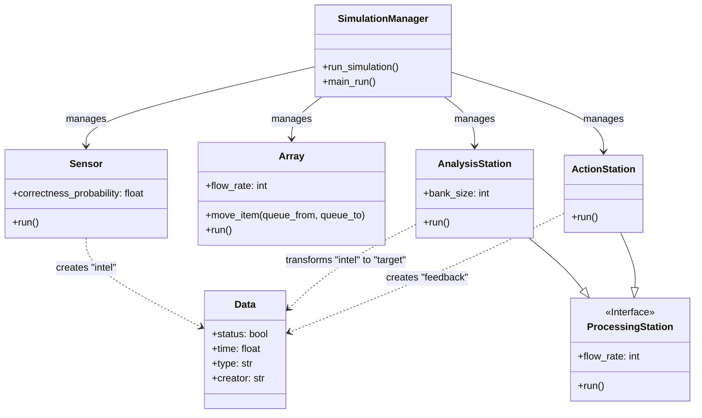
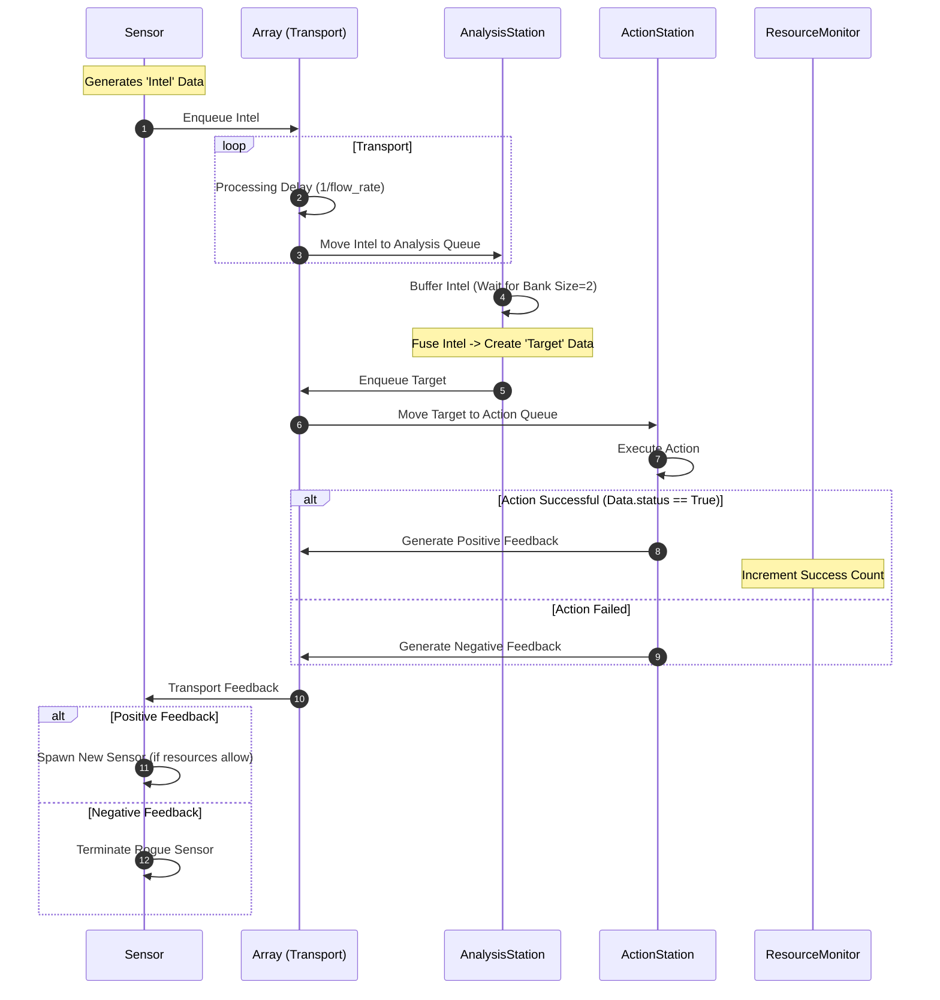

ISR (Intelligence, Surveillance, Reconnaissance) System Simulation
==================================================================

Project Overview
----------------

This project implements a Discrete-Event Simulation (DES) of an adaptive Intelligence, Surveillance, and Reconnaissance (ISR) system using **SimPy**. The simulation models the end-to-end lifecycle of intelligence data—from generation by sensors to actionable targeting and feedback loops.

The primary goal of this simulation is to analyze **System Self-Organization** and **Resource Optimization**. The system dynamically adapts its topology (number of sensors, processing bandwidth, transport capacity) in response to performance feedback (success/failure of operations) and queue bottlenecks, all while constrained by a global maximum resource limit.

Key Features
------------

*   **Discrete-Event Architecture:** Utilizes `simpy` to model asynchronous processes, resource contention, and time-dependent state changes.
    
*   **Dynamic Resource Allocation (Self-Organization):**
    
    *   **Elastic Scaling:** Component flow rates (bandwidth) automatically expand or contract based on queue backpressure.
        
    *   **Evolutionary Sensor Population:** Sensors are dynamically instantiated or terminated based on the operational success of the intelligence they provide ("survival of the fittest").
        
*   **Closed-Loop Feedback System:** Implements a complete sensor-to-shooter loop where the outcome of an action (Action Station) generates feedback data that propagates back to source nodes to influence future behavior.
    
*   **Multiprocessing Support:** Includes a simulation manager (`main.py`) capable of spawning multiple parallel simulation runs to gather statistical significance.
    
*   **Real-Time Visualization:** Optional `tkinter` dashboard integration for real-time monitoring of queues, entity states, and system topology changes.
    
*   **Comprehensive Telemetry:** detailed data collection of "Self-Organization Effort," "Data Age" (latency), and "Accumulated Success" exported to Pandas DataFrames and Excel.
    

System Architecture
-------------------

### Class Structure

The system is composed of active agents (`Sensor`, `Array`, `Station`) and passive entities (`Data`). The `Simulation` module orchestrates the environment.

### Data Lifecycle (Sequence Diagram)

The following diagram illustrates the flow of a single piece of Intelligence data as it traverses the system, is fused into a Target, acted upon, and results in Feedback.

Prerequisites & Installation
----------------------------

The simulation runs on **Python 3.9+**.

### Dependencies

*   **SimPy**: Discrete-event simulation framework.
    
*   **NumPy / Pandas**: Data analysis and handling.
    
*   **Matplotlib**: Static plotting.
    
*   **Tkinter**: (Standard library) Required for runtime visualization.
    
*   **Psutil**: Memory monitoring during execution.
    

### Installation

Bash

    pip install simpy numpy pandas matplotlib psutil

Usage
-----

### Running the Simulation

The entry point is `main.py`. This script configures the parameters and launches multiprocessing workers.

Bash

    python main.py

### Configuration

Key configuration variables are located in `main.py`:

| Variable | Description | Default |
| --- | --- | --- |
| number_of_iterations | Number of parallel simulation runs. | 4 |
| end_time | Duration of the simulation (in ticks). | 1000 |
| max_resource | The global cap on system complexity (Sum of sensors + flow rates). | 100 |
| dt | Time delta for calculating rolling averages in statistics. | 5 |
| ui | Boolean flag. Set toTruefor visual mode,Falsefor headless batch runs. | False |
| self_org_feedback_activate | Toggle experimental self-organization logic based on threshold. | False |

### Visual Mode

To enable the Real-time UI, change `ui = True` in `main.py`. Note that this forces the environment to `simpy.rt.RealtimeEnvironment`, which synchronizes simulation time with wall-clock time for visualization purposes.

Simulation Logic
----------------

The core logic resides in `Simulation.py` and is governed by specific rules:

1.  **Transport Layer (`Array`):** The "Array" acts as the central bus. It is a single server with a variable service rate (`flow_rate`). It round-robins between source queues to move data to destination queues.
    
2.  **Analysis Logic:** The Analysis Station requires a specific "Bank Size" (default 2) of Intel items to fuse them into a single "Target" packet.
    
3.  **Feedback & Adaptation:**
    
    *   **Sensor Logic:** If an Action succeeds, the system attempts to scale up by adding a sensor (if `current_resources < max_resource`). If an action fails, the sensor responsible for the bad intel is identified and removed ("killed").
        
    *   **Bottleneck Management:** Background processes (`array_upgrade`, `analysis_upgrade`, etc.) monitor queue lengths. If a queue exceeds a threshold (`flow_rate * 5`), the station's flow rate is incremented. Conversely, if a queue is empty, resources are released (flow rate decremented).
        

Output & Interpretation
-----------------------

Upon completion, the simulation aggregates data using `Data_collector.py` and generates visualizations via `PlotClasses.py`.

### Metrics

*   **System Cost (Resources):** Tracks the total count of active sensors and the sum of flow rates. This proxies the "cost" or "complexity" of the system.
    
*   **Accumulated Success:** The cumulative count of successful operations over time.
    
*   **Self-Organization Measure:** A calculated metric representing the system's volatility. It sums the number of changes in resource allocation (flow rates changing, sensors added/removed) over a time window `dt`.
    
*   **Data Age:** The latency from the moment a data packet is created to the moment it is consumed.
    

### Files

If `print_excel = True`, the system generates `.xlsx` reports in the `excels/` directory containing time-series data for all tracked metrics.

---

